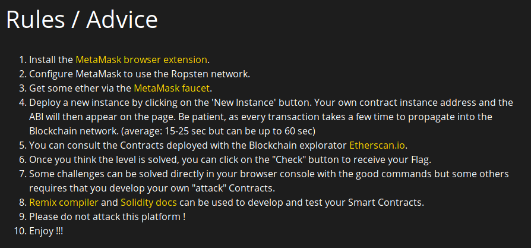
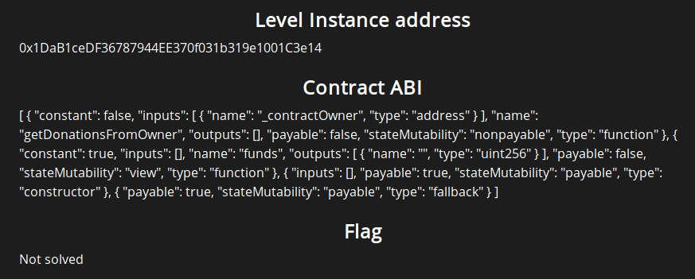
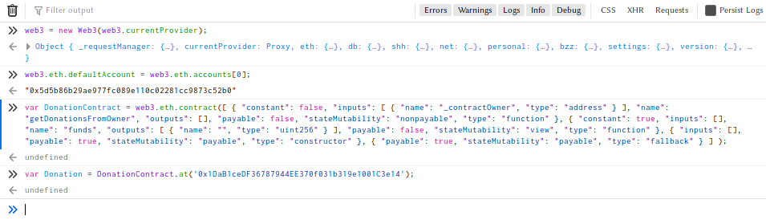
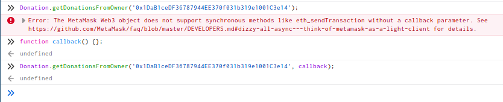
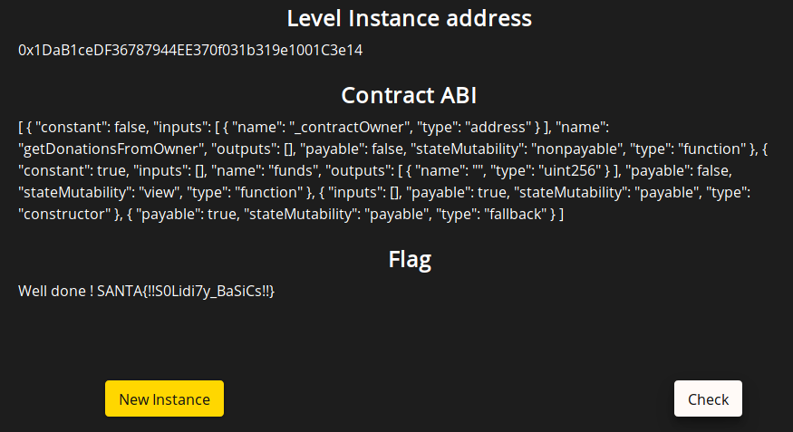

# Santhacklaus CTF 2019 - Golden Rush (Level 1 - Donation)

This challenge is the 1st level of the Golden Rush series from the Santhacklaus CTF 2019.
You can visit the CTF platform [here](https://ctf.santhacklaus.xyz) and the challenge at this location: https://goldenrush.santhacklaus.xyz/level1

For those who are totally new to blockchain challenges (as I was before this CTF), I recommend you to watch a few youtube videos and read some tutorials on how smart contracts work and on how to interact with them with Web3.js.

Here are some resources I found useful:
- [Blockchain Exploitation Series](https://www.youtube.com/playlist?list=PLCwnLq3tOElp0PFnuUFUIhpEeju5qrKJI)
- [Ethereum contract Application Binary Interface](https://youtu.be/F_l4HycnHAI)
- [Interacting with a Smart Contract through Web3.js (Tutorial)](https://medium.com/@yangnana11/interacting-with-a-smart-contract-through-web3-js-tutorial-56a7ff2ff153)
Now, let's start the challenge !

## Description

First since I had no idea where to start, I read and followed carefully the [advice section](https://goldenrush.santhacklaus.xyz/help) we had.



Once I had installed the MetaMask extension, I took a first look at the source code given to us:

```solidity
pragma solidity >=0.4.22 <0.6.0;

contract Donation {
    uint256 public funds;

    constructor() public payable{
        funds = funds + msg.value;
    }

    function() external payable {
        funds = funds + msg.value;
    }

    function getDonationsFromOwner(address _contractOwner) external {
        require(keccak256(abi.encodePacked(address(this)))==keccak256(abi.encodePacked(_contractOwner)));
        msg.sender.transfer(funds);
        funds = 0;
    }
}
```

As you can see, the contract is designed to transfer us the money it has if we execute the *getDonationsFromOwner* function with its argument *_contractOwner* equals to *address(this)*. A few research on Google tells us that this value is actually the address of the contract in the blockchain.


## Deploy the instance

By clicking on the button *New instance* we deploy an instance of the given contract. We get the address of our instance and its ABI. The address allows us to find the instance on [Etherscan.io](https://ropsten.etherscan.io/) and along with the ABI, they will allow us to interact with the contract.




## Get the money

For this challenge, we are going to use Web3.js to interact with the contract. After reading a few tutorials I finally made it work in the Firefox browser console ! First we create our web3 object, then we set the defaut account to the account injected by MetaMask.

If the default account is undefined, try executing `ethereum.enable()`, it should allow MetaMask to expose your account address as explained [here](https://medium.com/metamask/https-medium-com-metamask-breaking-change-injecting-web3-7722797916a8).

We then declare a *DonationContract* object defined by its ABI and a *Donation* variable that connects our DonationContract object with the instance deployed in the blockchain.



We can now try to execute the *getDonationFromOwner* function with our contract address as argument:

```javascript
Donation.getDonationsFromOwner('0x1DaB1ceDF36787944EE370f031b319e1001C3e14');
```

However, we get the following error:

> Error: The MetaMask Web3 object does not support synchronous methods like eth_sendTransaction without a callback parameter. See https://github.com/MetaMask/faq/blob/master/DEVELOPERS.md#dizzy-all-async---think-of-metamask-as-a-light-client for details.

Since I am very unfamiliar with Javascript, I don't really understand what a callback function is. I found some definitions on the Internet but I just decided to solve this problem by declaring an empty function that I used as callback:



It seems that the query has worked since a MetaMask window pops up asking me to confirm my interaction !

The operation takes a few seconds to execute and then we are finally able to claim our flag (yay!):


