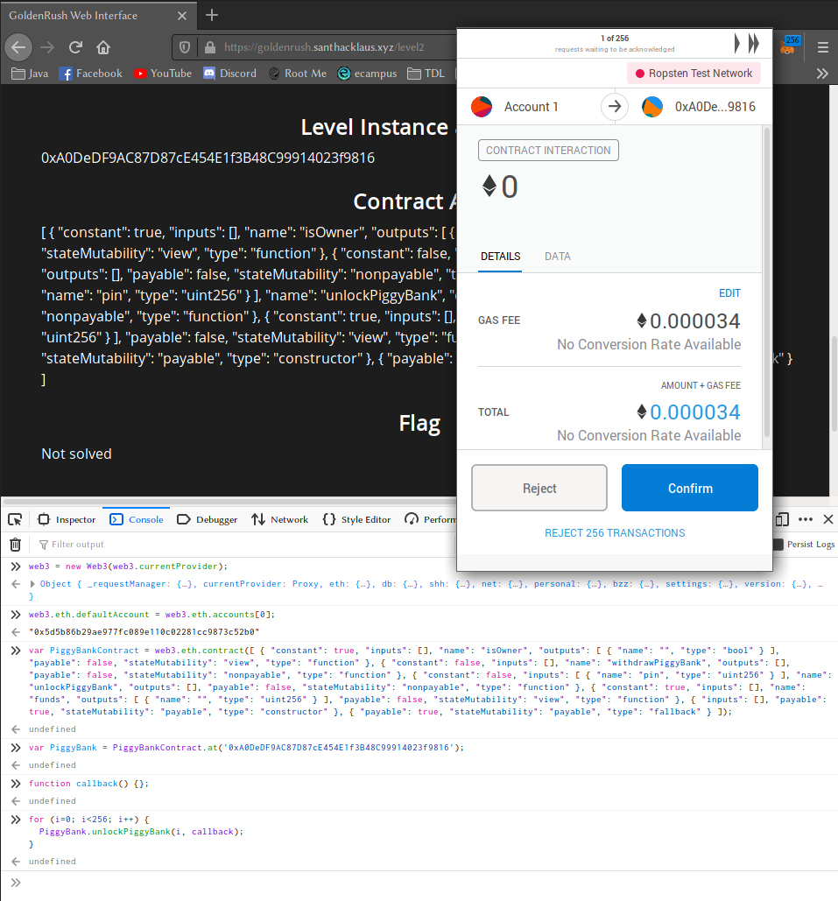
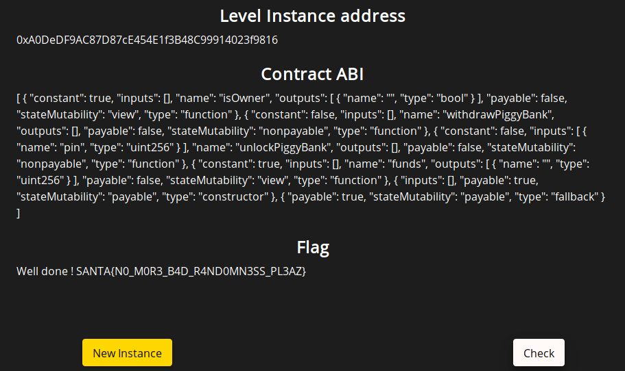

# Santhacklaus CTF 2019 - Golden Rush (Level 2 - Piggybank)

This challenge is the 2nd level of the Golden Rush series from the Santhacklaus CTF 2019.
You can visit the CTF platform [here](https://ctf.santhacklaus.xyz) and the challenge at this location: https://goldenrush.santhacklaus.xyz/level2

## Read the source code

For the second level, we are given the following source code:

```solidity
pragma solidity ^0.4.21;

contract PiggyBank {
    bool public isOwner = false;
    uint256 public funds;
    bytes32 private pinHash = 0x7d8db9357f1302f94064334778507bb7885244035ce76b16dc05318ba7bf624c;

    constructor() public payable {
        funds = funds + msg.value;
    }

    function() external payable {
        funds = funds + msg.value;
    }

    function unlockPiggyBank(uint256 pin) external {
        if((keccak256(abi.encodePacked(uint8(pin))) == pinHash)){
        isOwner = true;
        }
    }

    function withdrawPiggyBank() external {
        require(isOwner == true);
        msg.sender.transfer(funds);
        isOwner = false;
        funds = 0;
    }
}
```
This time, it seems that our Piggy Bank contract needs its *isOwner* varible set to true to allow us to withdraw our money. Therefore, we should probably look into the *unlockPiggyBank* function.

This function will set *isOwner* to true only if the *pin* argument we give him is the origin value of the hash *pinHash*.

## Unlock the piggy

The vulnerability here is that the pin is converted to an *uint8* before being tested, which means that the value we look for must be between 0 and 255. Indeed, it would not be possible otherwise to unlock the piggy bank with this function.

I will explain how I solved the challenge (beware it's quite dirty lol)

So, when I realized that I only had 256 possibilities to test, I understood that I had to bruteforce the pin, so I decided to send 256 interactions to the deployed contract with my browser console.

After connecting our Web3 object to the contract in the blockchain (see the writeup for the level 1 for more details on the commands), I realized that I will have to click on *Confirm* 256 times on the MetaMask pop up...



Since this task seemed quite labourious to me, I tried to find some idle solution to make my cursor auto-click on the button: I used *xdotool* to localise the position of the *Confirm* button on my screen and then I told him to click for me every second so so that I can play Summoners War in the meantime :D

```bash
sleep 3; xdotool getmouselocation # You have 3 seconds to get your cursor to the Confirm button
# x:792 y:597 screen:0 window:37748739
while true; do xdotool mousemove 792 597 click 1 &; sleep 1; done
# Don't forget the sleep 1 or else you're doomed...
```

Then a few minutes later, when xdotool had finished confirming all those operations, I moved my cursor back to my terminal and pressed ctrl+C really fast to stop the clicking!!

I stole the money by executing:

```javascript
PiggyBank.withdrawPiggyBank(callback);
```
and finally got the flag:



Only a few hours later did I realize that it was probably possible to compute the 256 hashes beforehand to know exactly which value the hash was before sending a single query to the contract with the correct value... but too late :D
